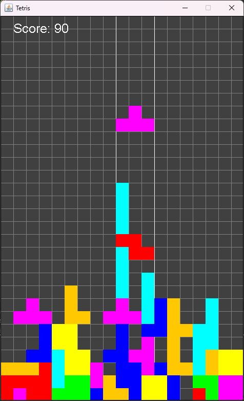
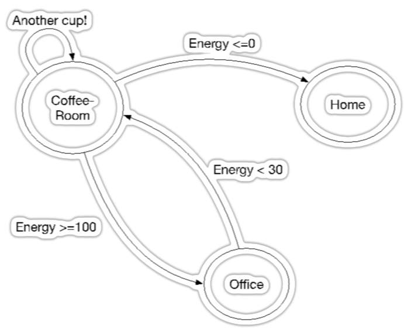

# OOP projects (JAVA)
*OOP project assignments for course IT401G (Object oriented programming) at Skövde University.*


## Assignment 4 (Tetris):
A tetris game built using Java and Swing.
- Implementing dynamic game speed adjustments based on the player's accumulated points.
- Guidelines highlighting where the currently falling block will land.
- Advanced controlls, Arrow up <kbd>&uarr;</kbd> rotates currently falling block 90°. Arrow down <kbd>&darr;</kbd> increases falling speed. Space <kbd>space</kbd> makes block instantly fall to bottom. 
- Points are given based on multiple factors; the total number of fallen blocks, and full rows. 
- User looses when blocks can no longer freely spawn at the top of the board.
<br><br>


## Assignment 3 (Coffee simulation):
Multithreaded simulation of workers queuing.

- Workers have unique names and energy levels (0 to 100).
- When a worker's energy falls below 30, they go to the coffee room.
- The coffee machine provides drinks (BlackCoffee, Cappuccino, Latte) to replenish energy.
- It takes 2 seconds for the machine to produce a drink, which is added to the reserve (max capacity: 20 drinks).
- Workers queue for the coffee machine and are served in a FIFO order.
- If a worker's energy is still below 100 after drinking, they go back to the queue.
- Worker's energy decreases by 1 point every T seconds (T is randomly assigned: 500 ms to 1500 ms).
- Workers leave the queue if their energy reaches 0 while waiting.
- Simulate worker's energy-based states during a given time window in seconds.
<br>
Simulation output:
```
worker2 Is working with energy level 43
worker5 Is working with energy level 54
worker0 is taking a break with energy level 29
worker8 Is working with energy level 61
worker1 Is working with energy level 54
worker7 is taking a break with energy level 26
worker6 is taking a break with energy level 20
worker9 is taking a break with energy level 29
worker2 Is working with energy level 42
worker4 Is working with energy level 54
```