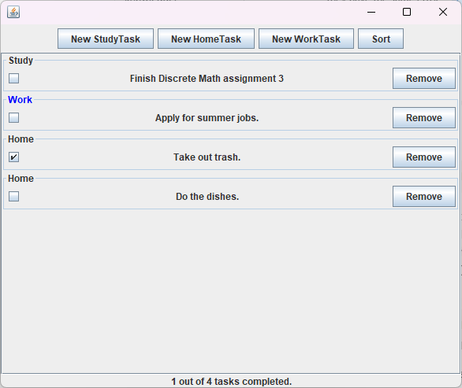

# OOP projects (JAVA)
*OOP project assignments for course IT401G (Object oriented programming) at Skövde University.*


## Assignment 4 (Tetris):
A tetris game built using Java and Swing.
- Implementing dynamic game speed adjustments based on the player's accumulated points.
- Guidelines highlighting where the currently falling block will land.
- Advanced controlls, Arrow up <kbd>&uarr;</kbd> rotates currently falling block 90°. Arrow down <kbd>&darr;</kbd> increases falling speed. Space <kbd>space</kbd> makes block instantly fall to bottom. 
- Points are given based on multiple factors; the total number of fallen blocks, and full rows. 
- User looses when blocks can no longer freely spawn at the top of the board.
<br><br>


## Assignment 3 (Coffee simulation):
Multithreaded simulation of workers queuing.

- Workers have unique names and energy levels (0 to 100).
- When a worker's energy falls below 30, they go to the coffee room.
- The coffee machine provides drinks (BlackCoffee, Cappuccino, Latte) to replenish energy.
- It takes 2 seconds for the machine to produce a drink, which is added to the reserve (max capacity: 20 drinks).
- Workers queue for the coffee machine and are served in a FIFO order.
- If a worker's energy is still below 100 after drinking, they go back to the queue.
- Worker's energy decreases by 1 point every T seconds (T is randomly assigned: 500 ms to 1500 ms).
- Workers leave the queue if their energy reaches 0 while waiting.
- Simulate worker's energy-based states during a given time window in seconds.

<sub>Simulation output:</sub>
```
...
worker2 Is working with energy level 43
worker5 Is working with energy level 54
worker0 is taking a break with energy level 29
worker8 Is working with energy level 61
worker1 Is working with energy level 54
worker7 is taking a break with energy level 26
worker6 is taking a break with energy level 20
worker9 is taking a break with energy level 29
worker2 Is working with energy level 42
worker4 Is working with energy level 54
...
```

## Assignment 2 (ToDO):
Java Swing assignment tracker.
<br>

- Create tasks.
- Mark tasks as complete.
- 3 different types of tasks, StudyTasks, HomeTasks, and WorkTasks. 
- When creating a worktask, the color can be chosen by the user. 
- Tasks can be sorted based on, completion, type and name. 

## Assignment 1 (Lucky Card):
Simple console based "Lucky Card" game.

```
------- Playing a game round
Card 0: Spades -> 10 Value = 20
Card 1: Hearts -> 9 Value = 17
Card 2: Diamonds -> 2 Value = 6
You lose!

=========> Press ENTER to play again or "q" to quit: 
```

A console application called "Lucky Card" where users can play a simple card game. The game involves shuffling a deck of cards and placing them in a heap. Each card is assigned a value based on its rank and suit. The value of a card is determined by adding the card's rank value with a bonus value associated with its suit. The bonus values are 4 for diamonds, 6 for clubs, 8 for hearts, and 10 for spades.

In each round of the game, the player draws three cards sequentially from the top of the deck. The objective is to determine if the value of the third card falls between the values of the first two cards. If it does, the player wins! However, if the third card is equal to either of the first two cards or falls outside the range of values between them, the player loses.